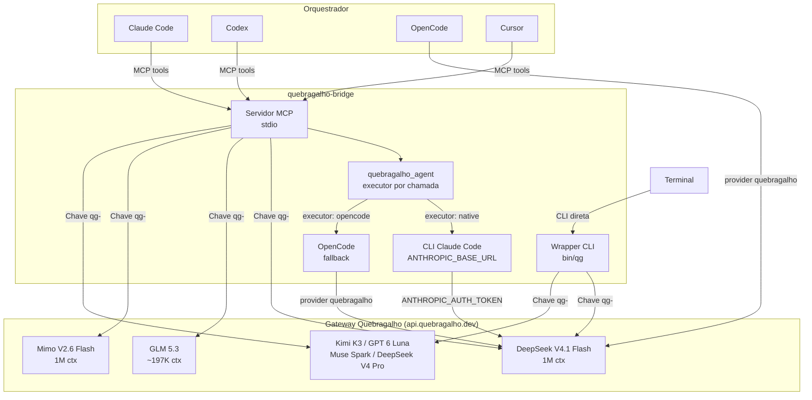
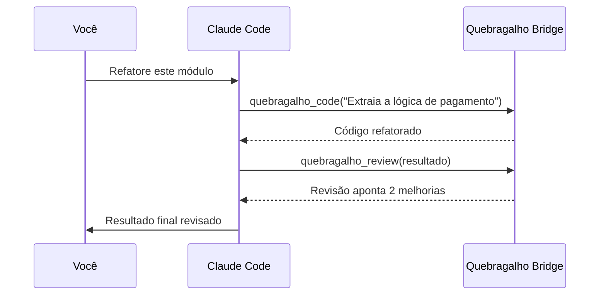

<p align="center">
  
  =18">
  <a href="https://www.npmjs.com/package/quebragalho-bridge"></a>
  
  
</p>

<div align="center">
  <a href="https://www.quebragalho.dev/">
    <h1>quebragalho-bridge</h1>
  </a>
  <p><strong>Use os modelos do gateway Quebragalho como sub-agentes no Claude Code, Codex, OpenCode, Cursor ou qualquer cliente MCP</strong></p>
  <p>Transforme o crédito pré-pago do <a href="https://www.quebragalho.dev/">gateway Quebragalho</a> em execução distribuída para seu orquestrador preferido</p>
</div>

---

## O provider

O [Quebragalho](https://www.quebragalho.dev/) é um gateway brasileiro pré-pago que revende acesso a modelos de fronteira por 51–80% abaixo do preço oficial:

- **Endpoint OpenAI-compatible:** `https://api.quebragalho.dev/v1` (`/chat/completions`);
- **Endpoint Anthropic-compatible:** `https://api.quebragalho.dev` (`/v1/messages`) — o mesmo usado por Claude Code;
- **Autenticação por API key** no formato `qg-...` (header `Authorization: Bearer`);
- **Pré-pago por Pix**, sem assinatura, sem cartão e sem limite de taxa (sem caps de 5h/semana);
- Crie a chave em ~30 segundos com `npx quebragalho init` ou no [app](https://app.quebragalho.dev);
- O gateway guarda apenas metadados de billing (tokens, modelo, data) — não armazena o texto dos prompts.

---

## Arquitetura



---

## Modelos disponíveis

O gateway anuncia 17 modelos no app; o bridge embarca os 8 públicos da
página inicial. Preços em USD por milhão de tokens, consultados em
30/09/2026 — confirme os valores atuais no
[catálogo oficial](https://app.quebragalho.dev/models) antes de recarregar.

| Modelo | Contexto | In / Out (US$/M) | Classe | Seleção automática | Ideal para |
|--------|----------|------------------|--------|:------------------:|-----------|
| **DeepSeek V4.1 Flash** | 1M | 0,14 / 0,56 | pro | Sim | Codificação geral (padrão do bridge) |
| **Mimo V2.6 Flash** | 1M | 0,03 / 0,06 | pro | Sim | Análise com contexto longo |
| **GPT 6 Luna** | 256K | 0,03 / 0,15 | pro | Sim | Generalista barato |
| **GLM 5.3 Flash** | ~200K | 0,05 / 0,17 | pro | Sim | Tarefas rápidas |
| **Muse Spark 1.3 Contributor** | ~128K | 0,03 / 0,05 | pro | Sim | O mais barato do catálogo |
| **GLM 5.3** | ~197K | 0,54 / 1,70 | ultra | Sim | Raciocínio complexo, segurança e web |
| **DeepSeek V4 Pro** | 1M | 0,32 / 0,97 | max | Com opt-in | Codificação mais exigente |
| **Kimi K3** | ~259K | 1,19 / 6,20 | max | Com opt-in | Tarefas gerais e visão |

> Contextos e limites de saída são estimativas da família de cada modelo e
> servem para roteamento e defaults de `max_tokens`; o limite real é o do
> gateway.

As classes substituem os antigos "planos" — aqui não existe assinatura:

- `pro`: dia a dia, baratos, sempre elegíveis;
- `ultra`: flagship (GLM 5.3), elegíveis por padrão;
- `max`: variantes caras (DeepSeek V4 Pro, Kimi K3) que **não** entram no
  roteamento automático para proteger o crédito pré-pago. Elas podem ser
  selecionadas explicitamente por `model` e limitadas com
  `QUEBRAGALHO_NATIVE_MODEL_ALLOWLIST`. Para incluí-las no ranking automático,
  defina `QUEBRAGALHO_AUTO_INCLUDE_PREMIUM_MODELS=1`; allowlist, denylist,
  classes e a política do executor continuam sendo aplicadas.

---

## Instalação rápida

1. **Crie sua chave `qg-`** (sem cartão):

   ```bash
   npx quebragalho init
   # ou gere a chave direto em https://app.quebragalho.dev
   ```

2. **Instale uma CLI estilo Claude Code** para o executor nativo (recomendado):

   ```bash
   npm install --global @anthropic-ai/claude-code
   ```

3. **Exponha a chave ao bridge**:

   ```bash
   export QUEBRAGALHO_API_KEY="qg-sua-chave"
   export QUEBRAGALHO_AGENT_ALLOWED_ROOTS="/caminho/para/seus/projetos"
   ```

Requisitos:

- Node.js 18+ para o bridge; 22+ recomendado para a CLI Claude Code;
- Codex, Claude Code, Cursor ou outro cliente MCP;
- Crédito no gateway — o bridge nunca gasta além do saldo depositado.

O bridge pode ser executado diretamente pelo pacote publicado, sem clonar este
repositório: `npx --yes quebragalho-bridge@latest`. Para desenvolver o bridge
localmente, use:

```bash
git clone https://github.com/danjour/quebragalho-bridge.git
cd quebragalho-bridge
npm install
```

O fallback por OpenCode requer OpenCode 1.17.9+.

### Variável de ambiente

```bash
export QUEBRAGALHO_API_KEY="qg-sua-chave"            # obrigatória p/ tools diretas; repassada ao executor nativo
export QUEBRAGALHO_AGENT_ALLOWED_ROOTS="/caminho/para/seus/projetos"
# Padrão do executor; cada chamada pode escolher native ou opencode
export QUEBRAGALHO_AGENT_EXECUTOR="native"
# Opcional: caminho da CLI estilo Claude Code (padrão: claude)
export QUEBRAGALHO_CODE_BIN="/caminho/para/claude"
# Opcional: inclui variantes caras (DeepSeek V4 Pro, Kimi K3) no roteamento automático
export QUEBRAGALHO_AUTO_INCLUDE_PREMIUM_MODELS="1"
# Opcional e sensível: habilita edição (sem shell)
export QUEBRAGALHO_AGENT_WRITE_ENABLED="1"
# Memória técnica persistente e isolada por projeto
export QUEBRAGALHO_MEMORY_ENABLED="1"
export QUEBRAGALHO_MEMORY_DIR="$HOME/.local/share/quebragalho-bridge/memory"
# Índices curados opcionais, somente leitura
export QUEBRAGALHO_SHARED_MEMORY_FILES="$HOME/.codex/memories/MEMORY.md:$HOME/ObsidianVaults/ClaudeBrain/MEMORY.md"
```

`quebragalho_agent` aceita `executor: "native"` ou `executor: "opencode"` em cada
chamada. A escolha da chamada tem precedência sobre `QUEBRAGALHO_AGENT_EXECUTOR`.
Sem nenhuma configuração, o padrão é `native`.

O executor nativo recebe do bridge, automaticamente:

- `ANTHROPIC_BASE_URL=https://api.quebragalho.dev` (derivado de
  `QUEBRAGALHO_BASE_URL` sem o sufixo `/v1`);
- `ANTHROPIC_AUTH_TOKEN` com o valor de `QUEBRAGALHO_API_KEY`.

Assim o subprocesso fatura no gateway pré-pago em vez de usar a sessão própria
da CLI. Se você já define `ANTHROPIC_BASE_URL`/`ANTHROPIC_AUTH_TOKEN` no
ambiente do servidor MCP, eles têm precedência. Sem chave nenhuma, a CLI nativa
cai na própria sessão dela — configure `QUEBRAGALHO_API_KEY` para garantir que
o tráfego vá ao gateway.

Se o comando `claude` não estiver no PATH do cliente MCP, aponte explicitamente:

```bash
export QUEBRAGALHO_CODE_BIN="/caminho/para/claude"
# ou, para qualquer CLI compatível com o headless do Claude Code via Node:
export QUEBRAGALHO_CODE_BIN="/caminho/para/node"
export QUEBRAGALHO_CODE_ENTRYPOINT="/caminho/para/cli.mjs"
```

Não grave a chave no repositório.

---

## Configuração por plataforma

Em qualquer cliente, o Quebragalho aparece como uma ferramenta MCP. Ao chamar
`quebragalho_agent` ou `quebragalho_agent_start`, o bridge inicia um subagente externo,
separado e ciente do repositório. Ele não aparece como um subagente nativo da interface.
`read_only` e `write` são apenas modos de permissão dessa execução.

> Em App/IDE ou tarefa não trivial, longa, paralela ou de duração incerta, use
> `quebragalho_agent_start`, mostre o `job_id`, continue trabalhando e consulte
> `quebragalho_job` com `status`/`result`. Reserve o `quebragalho_agent` síncrono para
> tarefas curtas. Se o MCP não aparecer, corrija ou reinicie a integração; não
> substitua a chamada por `claude -p`, `qg`, `opencode run` ou outro shell.

Antes de configurar, descubra os caminhos absolutos:

```bash
command -v npx
command -v claude
```

No Windows, descubra `node.exe` e a raiz global do npm pelo PowerShell:

```powershell
(Get-Command node.exe).Source
npm root --global
```

Use esses caminhos nos exemplos abaixo. Variáveis, `~` e substituições de
comando não são expandidas dentro de JSON ou TOML.

| Cliente | Configuração | Como validar |
|---|---|---|
| Codex App, CLI e extensão IDE | `~/.codex/config.toml` | App/IDE: `/mcp`; CLI: `codex mcp get quebragalho-bridge` |
| Claude Desktop | Settings → Developer → Edit Config | Chat: **Connectors**; logs em `~/Library/Logs/Claude` |
| Claude Code | `claude mcp add` ou `.mcp.json` | `claude mcp get quebragalho-bridge` e `/mcp` |
| Cursor IDE e CLI | `~/.cursor/mcp.json` ou `.cursor/mcp.json` | **Available Tools** ou `cursor-agent mcp list-tools quebragalho-bridge` |
| OpenCode | `opencode.json` | `opencode mcp list` |

Esses clientes iniciam o servidor local por `stdio`. Apps web ou mobile que
não conseguem executar um processo local exigem o transporte HTTP/stateless
planejado no P2; essa superfície remota ainda não está implementada.

### Codex App, CLI e extensão IDE

O App, a CLI e a extensão compartilham a mesma configuração. Adicione a
`~/.codex/config.toml`:

```toml
[mcp_servers.quebragalho-bridge]
command = "/caminho/absoluto/para/npx"
args = ["--yes", "quebragalho-bridge@latest"]
startup_timeout_sec = 60
tool_timeout_sec = 1800
default_tools_approval_mode = "prompt"

[mcp_servers.quebragalho-bridge.env]
QUEBRAGALHO_API_KEY = "qg-sua-chave"
QUEBRAGALHO_AGENT_ALLOWED_ROOTS = "/caminho/absoluto/para/seus/projetos"
QUEBRAGALHO_AGENT_EXECUTOR = "native"
QUEBRAGALHO_CODE_BIN = "/caminho/absoluto/para/claude"
# Opcional: inclui DeepSeek V4 Pro e Kimi K3 no ranking automático
QUEBRAGALHO_AUTO_INCLUDE_PREMIUM_MODELS = "1"
```

No Codex App, também é possível abrir **Settings → MCP servers → Add server**,
escolher **STDIO** e preencher os mesmos valores. Salve e reinicie o App. Na
extensão IDE, reinicie a extensão. Consulte a
[documentação oficial de MCP do Codex](https://developers.openai.com/codex/mcp).

No Codex App para Windows, instale os dois pacotes uma vez:

```powershell
npm install --global quebragalho-bridge@latest @anthropic-ai/claude-code
```

> O CI Windows cobre a suíte de testes, não a integração com o Codex App.
> O smoke no Codex App Windows real ainda não foi executado.

Então use os caminhos absolutos retornados pelos comandos acima. Este exemplo
evita os shims `npx.cmd` e `claude.cmd`, que não podem ser iniciados diretamente
com `shell: false`:

```toml
[mcp_servers.quebragalho-bridge]
command = 'C:\Program Files\nodejs\node.exe'
args = ['C:\Users\SEU_USUARIO\AppData\Roaming\npm\node_modules\quebragalho-bridge\index.mjs']
startup_timeout_sec = 60
tool_timeout_sec = 1800
default_tools_approval_mode = "prompt"

[mcp_servers.quebragalho-bridge.env]
QUEBRAGALHO_API_KEY = 'qg-sua-chave'
QUEBRAGALHO_AGENT_ALLOWED_ROOTS = 'C:\Users\SEU_USUARIO\Projects;D:\Work'
QUEBRAGALHO_JOB_STORE_DIR = 'C:\Users\SEU_USUARIO\AppData\Local\quebragalho-bridge\jobs'
QUEBRAGALHO_AGENT_EXECUTOR = "native"
QUEBRAGALHO_CODE_BIN = 'C:\Users\SEU_USUARIO\AppData\Roaming\npm\node_modules\@anthropic-ai\claude-code\cli.js'
```

Substitua `C:\Program Files\nodejs\node.exe` pela saída de
`(Get-Command node.exe).Source` e a raiz
`C:\Users\SEU_USUARIO\AppData\Roaming\npm\node_modules` pela saída de
`npm root --global`. Com nvm-windows, fnm, Volta, Scoop ou um prefixo global
customizado, esses caminhos são diferentes.

No Windows, separe múltiplas raízes permitidas com `;`. O diretório do store
deve ser absoluto: metadados seguros e marcadores de `RESTART` persistem, mas
resultados públicos não são gravados porque o Node não garante uma ACL privada.
Eles podem conter código proprietário. `npx --yes quebragalho-bridge@latest` continua
suportado em terminais e clientes que executam shims `.cmd`; a configuração direta
acima é a opção previsível para o Codex App.

Alternativa pela CLI no macOS ou Linux:

```bash
QUEBRAGALHO_PROJECTS_ROOT="$HOME/Projects"

codex mcp add quebragalho-bridge \
  --env "QUEBRAGALHO_API_KEY=qg-sua-chave" \
  --env "QUEBRAGALHO_AGENT_ALLOWED_ROOTS=$QUEBRAGALHO_PROJECTS_ROOT" \
  --env "QUEBRAGALHO_AGENT_EXECUTOR=native" \
  --env "QUEBRAGALHO_CODE_BIN=$(command -v claude)" \
  -- "$(command -v npx)" --yes quebragalho-bridge@latest

codex mcp get quebragalho-bridge
```

O comando não adiciona os timeouts e a política de aprovação; complete esses
campos no TOML. Se o servidor já existir, não repita o `add`: edite o bloco
existente.

O Codex controla a aprovação da chamada MCP. Para automação não interativa com
`codex exec`, aprove somente as ferramentas necessárias:

```toml
[mcp_servers.quebragalho-bridge.tools.quebragalho_route]
approval_mode = "approve"

[mcp_servers.quebragalho-bridge.tools.quebragalho_agent_start]
approval_mode = "approve"

[mcp_servers.quebragalho-bridge.tools.quebragalho_job]
approval_mode = "approve"
```

Isso evita `user cancelled MCP tool call` quando não há interface para responder
ao prompt. Não use aprovação global irrestrita como atalho.

Para também aprovar `quebragalho_validate`, primeiro habilite deliberadamente
`QUEBRAGALHO_AGENT_VERIFY_ENABLED=1` no ambiente do bridge. Só então adicione:

```toml
[mcp_servers.quebragalho-bridge.tools.quebragalho_validate]
approval_mode = "approve"
```

Sem esse gate, `quebragalho_validate` falha fechado.

### Claude Desktop

O Claude Desktop está disponível para macOS e Windows. Abra
**Settings → Developer → Edit Config** e edite:

- macOS: `~/Library/Application Support/Claude/claude_desktop_config.json`;
- Windows: `%APPDATA%\Claude\claude_desktop_config.json`.

```json
{
  "mcpServers": {
    "quebragalho-bridge": {
      "command": "/caminho/absoluto/para/npx",
      "args": ["--yes", "quebragalho-bridge@latest"],
      "env": {
        "QUEBRAGALHO_API_KEY": "qg-sua-chave",
        "QUEBRAGALHO_AGENT_ALLOWED_ROOTS": "/caminho/absoluto/para/seus/projetos",
        "QUEBRAGALHO_AGENT_EXECUTOR": "native",
        "QUEBRAGALHO_CODE_BIN": "/caminho/absoluto/para/claude"
      }
    }
  }
}
```

Feche completamente o Claude Desktop e abra novamente. No chat, clique em
**Add files, connectors, and more → Connectors → Manage connectors** e confirme
que `quebragalho-bridge` está conectado. A configuração segue o
[guia oficial de servidores MCP locais](https://modelcontextprotocol.io/docs/develop/connect-local-servers).

#### Claude Desktop no Windows com WSL

O Claude Desktop no Windows roda o comando configurado fora da distro WSL. Um
padrão comum é apontar `command` para `wsl.exe` e usar `args` com
`bash -c '...'`, por exemplo:

```json
{
  "command": "wsl.exe",
  "args": ["bash", "-c", "/home/SEU_USUARIO/.nvm/versions/node/vX.Y.Z/bin/npx --yes quebragalho-bridge@latest"]
}
```

Isso costuma falhar com **"Server disconnected"** sem log útil quando o Node
é instalado via nvm. Causa raiz (verificada localmente com `env -i`, que
simula o PATH mínimo de um shell não-login): `bash -c` abre um shell
**não-login e não-interativo**, que não lê `~/.bashrc` nem o init do nvm por
padrão. O `npx` do nvm é um script Node com shebang `#!/usr/bin/env node`;
sem o diretório do nvm no `PATH`, o `env` não acha o `node` e o processo
morre na hora, com `env: node: No such file or directory` (exit 127) antes
mesmo de abrir a conexão MCP. O comportamento de `bash -c` não carregar
`~/.bashrc` é padrão do Bash em qualquer SO; se o `~/.profile`/`~/.bash_profile`
da distro específica encadeia para `~/.bashrc` (varia por distro e não foi
verificado numa instalação Windows real), isso pode ou não compensar.

**Correção recomendada (à prova de PATH, não depende de shell profile):**
instale o pacote globalmente uma vez, dentro de uma sessão WSL onde `npm`
já funciona, e aponte o Claude Desktop para o wrapper `quebragalho-mcp` do
pacote, informando o caminho do Node em `QUEBRAGALHO_NODE_BIN`:

```bash
# uma vez, dentro do WSL
npm install --global quebragalho-bridge
npm root -g   # confirma o caminho de lib/node_modules
```

```json
{
  "mcpServers": {
    "quebragalho-bridge": {
      "command": "wsl.exe",
      "args": [
        "bash",
        "-c",
        "QUEBRAGALHO_NODE_BIN=/home/SEU_USUARIO/.nvm/versions/node/vX.Y.Z/bin/node QUEBRAGALHO_API_KEY=qg-sua-chave QUEBRAGALHO_AGENT_ALLOWED_ROOTS=/caminho/absoluto/para/seus/projetos QUEBRAGALHO_AGENT_EXECUTOR=native QUEBRAGALHO_CODE_BIN=/caminho/absoluto/para/claude exec /home/SEU_USUARIO/.nvm/versions/node/vX.Y.Z/lib/node_modules/quebragalho-bridge/bin/quebragalho-mcp"
      ]
    }
  }
}
```

As variáveis vão **dentro do comando**, e não no bloco `env` do
`claude_desktop_config.json`. Aquele bloco define variáveis no ambiente do
Windows, e o `wsl.exe` não as repassa para dentro do WSL sem configurar
`WSLENV`. Declarando antes do `exec`, elas chegam ao processo Linux que
realmente executa o servidor.

O wrapper resolve o interpretador por `QUEBRAGALHO_NODE_BIN` antes de qualquer
`PATH` de shell, então nenhuma suposição sobre o profile da distro entra em
jogo, e quando o binário informado não existe ele explica a causa no stderr
em vez de morrer sem mensagem.

Use o wrapper, e não o `index.mjs` direto: é ele que carrega o
`QUEBRAGALHO_ENV_FILE` e exporta a `QUEBRAGALHO_API_KEY` antes de subir o servidor.
Apontando para o `index.mjs`, quem guarda as credenciais nesse arquivo fica
sem autenticação.

**Não use `bash -lc` como atalho.** Parece resolver, mas na instalação
padrão do nvm em Ubuntu o init fica no `~/.bashrc`, que começa com um
early-return para shell não-interativo. Mesmo em shell de login o `node`
continua fora do `PATH`, e o sintoma é idêntico ao original, o que só
dificulta o diagnóstico.

Se você não usa `QUEBRAGALHO_ENV_FILE` e prefere invocar o `index.mjs` sem
intermediário, troque o alvo do `exec` pelo caminho do `node` seguido do
`index.mjs` instalado, mantendo as variáveis declaradas antes do `exec`.

Por fim, `npx --yes quebragalho-bridge@latest` sempre resolve a versão mais
recente do registro e pode baixar o pacote a cada início do cliente MCP,
o que soma latência e depende de rede a cada abertura do Claude Desktop.
Preferir instalação global (`npm install --global quebragalho-bridge`) evita essa
resolução de rede repetida e é o caminho mais robusto para uso contínuo.

### Claude Code CLI

Para disponibilizar o bridge em todos os projetos no macOS ou Linux:

```bash
QUEBRAGALHO_PROJECTS_ROOT="$HOME/Projects"

claude mcp add --transport stdio --scope user \
  -e "QUEBRAGALHO_API_KEY=qg-sua-chave" \
  -e "QUEBRAGALHO_AGENT_ALLOWED_ROOTS=$QUEBRAGALHO_PROJECTS_ROOT" \
  -e "QUEBRAGALHO_AGENT_EXECUTOR=native" \
  -e "QUEBRAGALHO_CODE_BIN=$(command -v claude)" \
  quebragalho-bridge -- "$(command -v npx)" --yes quebragalho-bridge@latest

claude mcp get quebragalho-bridge
```

Se o bridge já estiver configurado no Claude Desktop, também é possível executar
`claude mcp add-from-claude-desktop` e selecionar `quebragalho-bridge`. No Claude
Code, use `/mcp` para conferir e aprovar o servidor. Veja a
[documentação oficial do Claude Code](https://code.claude.com/docs/en/mcp).

> Nota: o `claude` que orquestra e o `claude` usado como executor nativo são o
> mesmo binário, mas processos separados. O subprocesso do bridge recebe
> `ANTHROPIC_BASE_URL`/`ANTHROPIC_AUTH_TOKEN` apontando ao gateway Quebragalho,
> então não consome a assinatura Anthropic da sua sessão interativa.

### Cursor IDE e CLI

Use `~/.cursor/mcp.json` para todos os projetos ou `.cursor/mcp.json` apenas no
repositório atual:

```json
{
  "mcpServers": {
    "quebragalho-bridge": {
      "command": "/caminho/absoluto/para/npx",
      "args": ["--yes", "quebragalho-bridge@latest"],
      "env": {
        "QUEBRAGALHO_API_KEY": "qg-sua-chave",
        "QUEBRAGALHO_AGENT_ALLOWED_ROOTS": "/caminho/absoluto/para/seus/projetos",
        "QUEBRAGALHO_AGENT_EXECUTOR": "native",
        "QUEBRAGALHO_CODE_BIN": "/caminho/absoluto/para/claude"
      }
    }
  }
}
```

Reinicie o Cursor. No Agent/Composer, abra **Available Tools**, habilite
`quebragalho-bridge` e aprove a chamada quando solicitado. Pela CLI:

```bash
cursor-agent mcp list
cursor-agent mcp list-tools quebragalho-bridge
```

O IDE e o `cursor-agent` leem o mesmo formato, conforme a
[documentação oficial do Cursor](https://docs.cursor.com/context/model-context-protocol).

### OpenCode

Adicione o servidor local ao `opencode.json`:

```json
{
  "$schema": "https://opencode.ai/config.json",
  "mcp": {
    "quebragalho-bridge": {
      "type": "local",
      "command": [
        "/caminho/absoluto/para/npx",
        "--yes",
        "quebragalho-bridge@latest"
      ],
      "environment": {
        "QUEBRAGALHO_API_KEY": "qg-sua-chave",
        "QUEBRAGALHO_AGENT_ALLOWED_ROOTS": "/caminho/absoluto/para/seus/projetos",
        "QUEBRAGALHO_AGENT_EXECUTOR": "native",
        "QUEBRAGALHO_CODE_BIN": "/caminho/absoluto/para/claude"
      },
      "enabled": true,
      "timeout": 1800000
    }
  }
}
```

O timeout do OpenCode é expresso em milissegundos; `1800000` acompanha o teto de
30 minutos do job assíncrono. Valide com `opencode mcp list`. O OpenCode prefixa
as ferramentas com o nome do servidor; no prompt, peça explicitamente para usar
o MCP `quebragalho-bridge`. Veja a [documentação oficial do
OpenCode](https://opencode.ai/docs/mcp-servers).

O provedor direto abaixo só é necessário para usar `executor: "opencode"` como
fallback, em vez do executor nativo:

```json
{
  "provider": {
    "quebragalho": {
      "name": "Quebragalho",
      "npm": "@ai-sdk/openai-compatible",
      "options": {
        "baseURL": "https://api.quebragalho.dev/v1",
        "apiKey": "{env:QUEBRAGALHO_API_KEY}"
      },
      "models": {
        "deepseek-v4.1-flash":          { "name": "DeepSeek V4.1 Flash", "limit": { "context": 1048576, "output": 65536 } },
        "deepseek-v4-pro":              { "name": "DeepSeek V4 Pro",     "limit": { "context": 1048576, "output": 65536 } },
        "glm-5.3":                      { "name": "GLM 5.3",             "limit": { "context": 196608,  "output": 65536 } },
        "glm-5.3-flash":                { "name": "GLM 5.3 Flash",       "limit": { "context": 200704,  "output": 65536 } },
        "mimo-v2.6-flash":              { "name": "Mimo V2.6 Flash",     "limit": { "context": 1048576, "output": 65536 } },
        "kimi-k3":                      { "name": "Kimi K3",             "limit": { "context": 259072,  "output": 65536 } },
        "gpt-6-luna":                   { "name": "GPT 6 Luna",          "limit": { "context": 256000,  "output": 65536 } },
        "muse-spark-1.3-contributor":   { "name": "Muse Spark 1.3",      "limit": { "context": 131072,  "output": 65536 } }
      }
    }
  }
}
```

### Habilitar edição em qualquer cliente

Sem configuração adicional, o subagente permanece em `read_only`. Para permitir
edição, adicione ao bloco de ambiente do cliente:

```text
QUEBRAGALHO_AGENT_WRITE_ENABLED=1
```

Na chamada, use também `mode: write`. Os dois opt-ins são obrigatórios. Mesmo
nesse modo, o subagente não recebe shell, não executa testes e não faz commit,
push ou deploy; essas etapas continuam com o orquestrador.

### Smoke test comum

Depois de reiniciar o cliente, execute em ordem:

> Use `quebragalho_route` para classificar “Revise este repositório”, sem executar
> agente.

> Inicie o subagente MCP com `quebragalho_agent_start`, `executor: native`,
> `mode: read_only`, `model: auto` e `cwd` apontando para o caminho absoluto
> deste repositório. Informe o `job_id`, continue trabalhando e consulte
> `quebragalho_job` até obter o resultado. Apenas analise; não edite.

---

## Uso

### Via MCP (Claude/Codex/Cursor)

Quando o servidor MCP estiver registrado, o orquestrador terá acesso a estas ferramentas:

| Ferramenta | Descrição |
|------|-----------|
| `quebragalho_route` | Classifica a tarefa e explica o ranking dos modelos sem executar um agente |
| `quebragalho_agent` | Variante síncrona para tarefa curta; bloqueia o cliente até concluir |
| `quebragalho_agent_start` | Padrão para App/IDE e trabalho não trivial; retorna `job_id` imediatamente |
| `quebragalho_job` | Consulta jobs sem bloquear: `status`, `result`, `list`, `cancel` |
| `quebragalho_memory` | Consulta ou registra uma nota técnica durável no diário isolado do projeto |
| `quebragalho_code` | Codificação com um modelo escolhido em `model` |
| `quebragalho_review` | Code review |
| `quebragalho_validate` | Validação de entrega |

As ferramentas por modelo (`quebragalho_deepseek_v4_1_flash`, `quebragalho_glm_5_3` e as
demais) não são publicadas na listagem. Elas tinham schema idêntico entre si
e custavam cerca de 900 tokens de contexto por sessão, sendo na prática o
parâmetro `model` de `quebragalho_code` repetido na vitrine. Escolha o modelo em
`quebragalho_code`:

```json
{ "name": "quebragalho_code", "arguments": { "prompt": "...", "model": "glm-5.3" } }
```

Chamadas pelo nome antigo continuam funcionando: o handler resolve
`quebragalho_<modelo>` normalmente. Para voltar a publicá-las na listagem, defina
`QUEBRAGALHO_LIST_MODEL_TOOLS=1`.

Exemplo de delegação nativa:

> _"Use `quebragalho_agent_start` com `executor: native`, em modo `write`, com cwd
> neste repo, para editar os testes deste módulo. Informe o `job_id`, continue
> trabalhando e consulte o resultado com `quebragalho_job`. Depois revise o diff e
> rode a suíte local no orquestrador."_

### Seleção automática e rotação

Use `quebragalho_route` quando quiser apenas saber qual modelo combina melhor com a
tarefa. A resposta inclui perfil detectado, ranking, pontuação e motivos, sem
consumir uma execução de agente.

No `quebragalho_agent`, `model: "auto"` é o padrão. O roteador combina:

- tipo da tarefa: codificação, segurança, revisão, UX/web, análise, contexto
  longo ou resposta rápida;
- afinidades declaradas de cada modelo;
- classe de custo permitida e allowlist/denylist administrativas;
- variantes caras (`max`: DeepSeek V4 Pro, Kimi K3) somente quando
  `QUEBRAGALHO_AUTO_INCLUDE_PREMIUM_MODELS=1` — controle de gasto em um gateway
  pré-pago;
- execuções em andamento, uso recente, falhas e cooldown.

Isso distribui chamadas concorrentes sem round-robin cego: o melhor modelo
continua preferido, mas um segundo modelo adequado pode assumir quando o
primeiro já está ocupado. Em `read_only`, um erro recuperável (`EXIT_ERROR` ou
timeout) recalcula o ranking e tenta outro candidato. `write` nunca faz fallback
automático, pois a tentativa que falhou pode já ter editado arquivos. Uma escolha
manual, como `model: "glm-5.3"`, nunca é substituída silenciosamente.

Exemplo:

```json
{
  "prompt": "Audite o isolamento multi-tenant e proponha testes",
  "cwd": "/projetos/meu-saas",
  "executor": "native",
  "mode": "read_only",
  "model": "auto"
}
```

O resultado informa `routing.strategy`, `auto_include_premium_models`,
`selected_model`, `reason`, `ranking`
e todas as `attempts`, para o orquestrador revisar a decisão.

Escolha do harness:

- `native`: usa uma CLI estilo Claude Code (padrão `claude`) apontada ao gateway
  pelo próprio bridge, via `ANTHROPIC_BASE_URL`/`ANTHROPIC_AUTH_TOKEN`;
- `opencode`: executa o mesmo agente delimitado pelo harness OpenCode e requer
  o provedor Quebragalho e a chave de API configurados;
- se `executor` for omitido, vale `QUEBRAGALHO_AGENT_EXECUTOR`; sem a variável, o
  padrão é `native`.

`read_only` bloqueia edição, shell, web, agentes aninhados e acesso fora do
projeto. `write` libera somente ferramentas de leitura e edição; shell, web,
agentes aninhados e diretórios externos permanecem desabilitados. O orquestrador
continua responsável por executar testes e outros comandos, revisar o diff,
commitar e fazer deploy. O subprocesso recebe somente uma allowlist mínima de
variáveis de ambiente; tokens de GitHub, AWS e outros serviços não são herdados.
O modo `write` falha fechado enquanto `QUEBRAGALHO_AGENT_WRITE_ENABLED` não for `1`.

### Memória dos subagentes

Com `QUEBRAGALHO_MEMORY_ENABLED=1`, o bridge mantém um diário JSONL separado para
cada `cwd` canônico. O nome do arquivo combina o nome do projeto com um hash do
caminho, impedindo que repositórios homônimos compartilhem contexto.

Ao finalizar, o agente devolve uma nota curta entre `<memory_note>` e
`</memory_note>`. O marcador é removido da resposta exibida, e somente a nota
sanitizada, o modelo, o modo, o executor e os artefatos internos são
persistidos. Prompt integral, raciocínio, código bruto, credenciais e saída
completa não são gravados. Notas sem marcador não viram memória automaticamente.
Tokens conhecidos, atribuições de credenciais, chaves privadas, e-mails, CPFs e
telefones também são redigidos novamente no caminho de leitura.

As últimas notas do projeto entram na próxima delegação com a instrução de
confirmar tudo no repositório. `QUEBRAGALHO_SHARED_MEMORY_FILES` pode adicionar
índices curados de Codex, Claude ou Obsidian como fontes de leitura. O bridge
limita quantidade e tamanho dessas fontes; ele não varre o vault inteiro.
Os caminhos compartilhados são uma allowlist administrativa explícita e seu
conteúdo passa pela mesma redação antes de chegar ao modelo.

Gravações concorrentes são serializadas por arquivo dentro do processo do
bridge. Para decisões críticas, o orquestrador pode usar `quebragalho_memory` com
`action: "remember"`; para auditoria, use `read` ou `status`.

### Uso manual fora dos orquestradores MCP

Os comandos abaixo são utilitários manuais. Claude, Codex, Cursor e OpenCode não
devem usá-los como fallback para `quebragalho_agent`.

```bash
# Prompt simples
qg "Explique closures em JavaScript"

# Com modelo específico e prompt de sistema
qg -m glm-5.3 -s "Seja conciso e técnico" "Analise a complexidade deste algoritmo"

# Pipe de arquivo
cat main.py | qg -m mimo-v2.6-flash "Revise este código"

# Listar modelos
qg --list
```

Flags auxiliares: `--timeout <segundos>` (default 120) limita cada requisição; `-q`/`--quiet` suprime as linhas decorativas para uso em pipes; `--version` imprime a versão do pacote. Erros de API (401, 429, 5xx) imprimem o corpo do erro no stderr e saem com código não-zero.

### Diagnóstico com `quebragalho-doctor`

Antes de abrir uma issue ou caçar configuração no README, rode o diagnóstico:

```bash
npx --yes --package quebragalho-bridge@latest quebragalho-doctor
```

Ele valida, com ✔/✖ e sugestão de correção por item: a chave `qg-` contra o gateway (`GET /v1/models`), se a CLI nativa (`claude`) é resolvível no PATH, se as raízes de `QUEBRAGALHO_AGENT_ALLOWED_ROOTS` existem, os diretórios de estado configurados (job store, memória, uso) e a versão do Node. Com `--json`, a mesma saída vem estruturada (útil para scripts).

### Imagens nas tools de prompt direto

`quebragalho_code` e as tools por modelo (`quebragalho_<modelo>`) aceitam `images`: array de 1 a 5 itens, cada um `{"path": "arquivo.png"}` (lido do disco e enviado como data URL base64) ou `{"url": "https://..."}` (repassado ao gateway); strings puras são aceitas como `path`. Formatos: png, jpg, jpeg, webp, gif; até 5 MiB por arquivo. Apenas modelos com visão aceitam o parâmetro — `glm-5.3`, `kimi-k3` e `gpt-6-luna`. Modelo sem visão retorna `MODEL_NO_VISION` com as alternativas; imagem inválida retorna `IMAGES_INVALID` com a causa. `quebragalho_review` não aceita imagens, e modelos trazidos por `QUEBRAGALHO_MODEL_SYNC` nunca são marcados com visão.

---

## Orientação automática e skill

O bridge não modifica `CLAUDE.md`, `AGENTS.md` nem regras do Cursor. Ao conectar,
ele já envia `instructions` pelo próprio protocolo MCP para Codex, Claude,
Cursor, OpenCode e outros hosts compatíveis. Essa orientação explica que
o Quebragalho é um subagente externo, recomenda `quebragalho_agent_start` para App/IDE ou
trabalho não trivial, reserva `quebragalho_agent` para tarefas curtas, recomenda
`executor: native` e `model: auto`, separa `read_only` de `write` e mantém
testes, Git e deploy com o orquestrador. Ela também proíbe fallback direto para a CLI.

Para reforçar a descoberta antes mesmo da primeira chamada MCP, instale também a
skill empacotada:

```bash
npx --yes --package quebragalho-bridge@latest quebragalho-install-instructions
```

Se já houver uma versão antiga da skill — especialmente uma que mencione
fallback pela CLI — atualize-a conscientemente:

```bash
npx --yes --package quebragalho-bridge@latest quebragalho-install-instructions --force
```

O instalador cria a mesma skill nestes locais:

- `~/.agents/skills/quebragalho-executor` — Codex e hosts compatíveis com Agent Skills;
- `~/.claude/skills/quebragalho-executor` — Claude Code;
- `~/.cursor/skills/quebragalho-executor` — Cursor IDE e CLI.

O OpenCode também descobre `~/.agents/skills`. O Claude Desktop recebe a
orientação pelo MCP; ele não usa `CLAUDE.md` para conectores locais. Sem
`--force`, o instalador falha quando encontra uma skill diferente e não a
sobrescreve.

A skill ensina o padrão de delegação:

1. Claude recebe a tarefa
2. Claude separa em **orquestração** (fica com Claude) + **volume** (delega para a Quebragalho)
3. Claude/Codex escolhe `executor: native` ou `executor: opencode`
4. Claude/Codex usa `quebragalho_agent_start` para trabalho não trivial, informa o
   `job_id` e continua orquestrando; `quebragalho_agent` fica reservado para tarefa curta
5. Claude/Codex consulta `quebragalho_job`, integra e valida o resultado

---

## Preços e pagamento do gateway

O Quebragalho é 100% pré-pago: sem assinatura, sem fidelidade e sem cartão.

| Item | Detalhe |
|------|---------|
| Recarga | Via Pix, a partir de qualquer valor |
| Promo | Créditos em dobro na primeira recarga a partir de R$ 25 (até R$ 100) |
| Moeda | Preços em USD, convertidos para BRL pela cotação do momento da requisição |
| Rate limit | Sem limites de taxa, janela de 5h ou teto semanal |
| Estouro | Com saldo zero as requisições param — nunca cobram além do depositado |
| Privacidade | O gateway guarda só metadados de billing; não usa seus prompts para treino |

Descontos por provedor anunciados: OpenAI −80%, Anthropic −60%, Qwen −80%,
Grok −60%, Kimi −59%, DeepSeek −53%. O catálogo completo (17 modelos) e os
preços por modelo ficam no [app oficial](https://app.quebragalho.dev/models).

---

## Exemplos reais

### Revisão de código em lote

```bash
# Revisar vários arquivos de uma vez com Quebragalho
for f in src/**/*.ts; do
  cat "$f" | qg -m mimo-v2.6-flash -s "Revise este arquivo TypeScript" > "reviews/$(basename $f).review.md"
done
```

### Refatoração assistida



### Geração de testes

> "Claude, use o `quebragalho_code` para gerar testes unitários para cada função neste módulo. Depois execute e me diga se passam."

---

## Recursos do servidor MCP

O servidor também expõe **recursos** e **prompts**:

| Tipo | URI | Descrição |
|------|-----|-----------|
| Recurso | `quebragalho://models` | Lista de modelos com especificações e origem (`local` ou `synced`) |
| Recurso | `quebragalho://status` | Status da conexão, sync de modelos e fila |
| Recurso | `quebragalho://usage` | Uso diário de tokens por modelo, gasto estimado do dia e teto configurado |
| Prompt | `revisar-codigo` | Template de code review |
| Prompt | `refatorar` | Template de refatoração |
| Prompt | `explicar` | Template de explicação |

---

## Variáveis de ambiente

| Variável | Padrão | Descrição |
|----------|---------|-----------|
| `QUEBRAGALHO_API_KEY` | — | Chave `qg-` do gateway; obrigatória para ferramentas de prompt direto e executor OpenCode, e repassada ao executor nativo como `ANTHROPIC_AUTH_TOKEN` |
| `QUEBRAGALHO_API_TIMEOUT_MS` | `300000` | Timeout de cada tentativa de chamada ao gateway (tools diretas e sync de modelos); valores fora de [1000, 1800000] são ajustados aos limites |
| `QUEBRAGALHO_API_RETRIES` | `2` | Retries automáticos para 429/5xx (total = N+1 tentativas), com backoff exponencial e respeito ao `Retry-After`; 4xx nunca é retentado; teto 5 |
| `QUEBRAGALHO_BASE_URL` | `https://api.quebragalho.dev/v1` | URL base da API OpenAI-compatible; o executor nativo deriva dela o `ANTHROPIC_BASE_URL` |
| `QUEBRAGALHO_LOG_LEVEL` | `info` | Nível de log: `debug`, `info`, `warn`, `error` |
| `QUEBRAGALHO_AGENT_ALLOWED_ROOTS` | — | Raízes repo-aware separadas pelo delimitador de paths do SO; sem valor, `quebragalho_agent` falha fechado |
| `QUEBRAGALHO_AGENT_WRITE_ENABLED` | — | Defina `1` para habilitar `write`; por padrão, somente `read_only` é aceito |
| `QUEBRAGALHO_AGENT_MAX_CONCURRENCY` | `4` | Execuções simultâneas globais, incluindo jobs assíncronos; inteiro entre 1 e 8, valores inválidos usam 4 |
| `QUEBRAGALHO_JOB_STORE_DIR` | — | Diretório para persistência atômica de metadados seguros e recuperação de jobs interrompidos; em macOS/Linux, use diretório privado 0700/0600 |
| `QUEBRAGALHO_JOB_PERSIST_RESULTS` | — | Em macOS/Linux, defina `1` com `QUEBRAGALHO_JOB_STORE_DIR` privado 0700/0600 para persistir e recuperar o resultado público terminal. No Windows falha fechado: resultados não são gravados porque o Node não garante ACL privada. Pode conter código proprietário; nunca grava prompt, runner data, cwd, env, raciocínio, memory note ou mensagens de erro |
| `QUEBRAGALHO_JOB_TTL_MS` | `1800000` (30 min) | TTL em ms para jobs finalizados sem resultado |
| `QUEBRAGALHO_JOB_RESULT_TTL_MS` | `600000` (10 min) | TTL em ms para resultados de jobs |
| `QUEBRAGALHO_JOB_MAX_RESULTS` | `100` | Máximo de resultados mantidos em memória (até 500) |
| `QUEBRAGALHO_JOB_MAX_QUEUED` | `50` | Máximo de jobs aguardando na fila |
| `QUEBRAGALHO_AGENT_MAX_MODEL_ATTEMPTS` | `2` | Tentativas de modelos no modo `auto` + `read_only`; inteiro entre 1 e 3 |
| `QUEBRAGALHO_AGENT_EXECUTOR` | `native` | Padrão administrativo; cada chamada pode substituir por `native` ou `opencode` |
| `QUEBRAGALHO_AGENT_VERIFY_ENABLED` | — | Defina `1` para habilitar `quebragalho_validate`; por padrão falha fechado |
| `QUEBRAGALHO_AGENT_VERIFY_PROJECT_CODE_ENABLED` | — | Segundo opt-in obrigatório para `npm test`/`npm run`; não é sandbox: executa código confiável com o usuário do bridge e pode escrever, ler arquivos/configs acessíveis e usar rede |
| `QUEBRAGALHO_AGENT_VERIFY_NPM_SCRIPTS` | — | Scripts separados por vírgula permitidos para `npm run`; `npm test` continua sujeito ao segundo opt-in |
| `QUEBRAGALHO_MEMORY_ENABLED` | — | Defina `1` para ativar memória técnica persistente dos subagentes |
| `QUEBRAGALHO_MEMORY_DIR` | `~/.local/share/quebragalho-bridge/memory` | Diretório dos diários JSONL isolados por projeto |
| `QUEBRAGALHO_MEMORY_MAX_BYTES` | `1048576` | Tamanho máximo do diário de memória; ao exceder, o arquivo rotaciona para `<arquivo>.1` (uma geração apenas) e o corrente recomeça vazio |
| `QUEBRAGALHO_SHARED_MEMORY_FILES` | — | Arquivos de memória curada, somente leitura, separados pelo delimitador de paths do SO |
| `QUEBRAGALHO_MODEL_ALLOWLIST` | todos | Modelos permitidos em todas as frentes (tools diretas, schemas, recursos, prompts, preview e agentes), separados por vírgula |
| `QUEBRAGALHO_MODEL_SYNC` | — | Defina `1` para sincronizar o catálogo com `GET {QUEBRAGALHO_BASE_URL}/models` logo após o servidor responder (uma tentativa, com o timeout da API). Modelos conhecidos mantêm metadados locais e adotam contexto/output reais; modelos novos entram com classe `pro` no roteamento automático; modelos locais ausentes do gateway são mantidos. Falha de rede/chave é fail-open com warn, e a origem de cada modelo aparece em `quebragalho://models` (`source: "local" \| "synced"`) e o resultado em `quebragalho://status` (`model_sync`). Ausente, `0` ou outro valor mantém o catálogo embutido |
| `QUEBRAGALHO_USAGE_DIR` | `~/.local/share/quebragalho-bridge/usage` | Diretório do diário JSONL de uso (um arquivo por dia local). Grava somente contadores e identificadores (timestamp, modelo, executor, tokens, requisições) — nunca prompt, cwd, env ou texto de resposta |
| `QUEBRAGALHO_MAX_SPEND_USD` | — | Teto diário de gasto estimado em US$ (preços por milhão de tokens no catálogo). Estourado ou diário ilegível = `BUDGET_EXCEEDED` (fail-closed) antes de tools diretas, `quebragalho_agent` e enfileiramento; aviso em 80% no rodapé das tools diretas e em `warnings` do agente. Ausente/vazia/inválida = sem limite. Reset diário é implícito (arquivo por dia) |
| `QUEBRAGALHO_MODEL_DENYLIST` | — | Modelos bloqueados em todas as frentes; são ocultados dos schemas/recursos e rejeitados antes de rede ou fila |
| `QUEBRAGALHO_MODEL_TIERS` | `pro,max,ultra` | Classes de custo permitidas no roteamento, preview e seleção manual (`pro` dia a dia, `ultra` flagship, `max` premium) |
| `QUEBRAGALHO_AUTO_INCLUDE_PREMIUM_MODELS` | — | Defina exatamente `1` para incluir variantes caras (`max`: DeepSeek V4 Pro, Kimi K3) no ranking automático. Ausente, `0` ou outro valor preserva o comportamento padrão. Allowlist, denylist, tiers e política do executor continuam valendo. |
| `QUEBRAGALHO_LIST_MODEL_TOOLS` | — | Defina `1` para voltar a publicar uma tool por modelo na listagem. Ausente, as chamadas por nome antigo seguem funcionando, mas as tools não aparecem na descoberta. |
| `QUEBRAGALHO_MODEL_COOLDOWN_SECONDS` | `60` | Cooldown de um modelo após falha recuperável |
| `QUEBRAGALHO_CODE_BIN` | `claude` | Executável da CLI estilo Claude Code usada pelo executor nativo; pode ser Node quando `QUEBRAGALHO_CODE_ENTRYPOINT` estiver definido |
| `QUEBRAGALHO_CODE_ENTRYPOINT` | — | Caminho opcional para o entrypoint da CLI quando ela roda via Node |
| `QUEBRAGALHO_NATIVE_MODEL_ALLOWLIST` | todos | Modelos permitidos no executor nativo; impede seleção silenciosa de modelos que a CLI não suporta |
| `QUEBRAGALHO_OPENCODE_MODEL_ALLOWLIST` | todos | Modelos permitidos especificamente no executor OpenCode |
| `QUEBRAGALHO_OPENCODE_BIN` | `opencode` | Caminho do OpenCode 1.17.9+ |
| `QUEBRAGALHO_ENV_FILE` | — | Arquivo opcional lido por `bin/quebragalho-mcp` para obter `QUEBRAGALHO_API_KEY` sem `source` |
| `QUEBRAGALHO_NODE_BIN` | `node` | Binário Node usado por `bin/quebragalho-mcp` |

---

## Solução de problemas

| Sintoma | Verificação e correção |
|---|---|
| `QUEBRAGALHO_AUTH_REQUIRED` no executor nativo | A chave `qg-` está ausente, inválida ou sem créditos. Confira `QUEBRAGALHO_API_KEY` no ambiente do servidor MCP e o saldo no app; depois reinicie o cliente. |
| `QUEBRAGALHO_CODE_NOT_FOUND` | Instale a CLI Claude Code (`npm install -g @anthropic-ai/claude-code`) ou configure `QUEBRAGALHO_CODE_BIN` com a saída de `command -v claude`. |
| `API 401: invalid api key` nas tools diretas | A chave não foi configurada ou foi digitada errada; gere outra em `app.quebragalho.dev` e atualize `QUEBRAGALHO_API_KEY`. Rode `quebragalho-doctor` para confirmar. |
| `API_TIMEOUT` numa tool direta | O gateway não respondeu dentro de `QUEBRAGALHO_API_TIMEOUT_MS` (default 5 min); verifique conexão/status do gateway ou aumente a env. |
| `BUDGET_EXCEEDED` | O teto diário `QUEBRAGALHO_MAX_SPEND_USD` foi atingido (ou o diário de uso está ilegível). Consulte `quebragalho://usage`, aumente o teto ou aguarde virar o dia local. |
| Requisições param do nada | Saldo zerado — o gateway é pré-pago e nunca cobra além do depositado. Recarregue via Pix. |
| `CWD_NOT_ALLOWED` ou `ALLOWED_ROOTS_MISSING` | Use caminhos absolutos e inclua a raiz do projeto em `QUEBRAGALHO_AGENT_ALLOWED_ROOTS`. |
| O bridge não aparece no Codex | Rode `codex mcp get quebragalho-bridge`, abra uma nova sessão e confira `/mcp`. |
| `user cancelled MCP tool call` no `codex exec` | A chamada aguardava aprovação sem terminal interativo. Use o Codex interativo ou aprove somente a ferramenta necessária no TOML. |
| O cliente abriu **Shell** e executou `claude -p` ou `qg` | O MCP não foi usado. Confirme `quebragalho_agent` na lista de ferramentas, atualize a skill com `quebragalho-install-instructions --force`, remova orientações antigas de fallback por CLI e reinicie o cliente. |
| `write` inicia, mas `Edit`/`Write` são negados por `dontAsk` | Atualize o bridge (`npm install --global quebragalho-bridge@latest`) e reinicie o cliente. O executor nativo usa `bypassPermissions`; o modo escolhido pelo orquestrador ainda delimita as ferramentas, e shell, web, hooks, agentes aninhados e segredos continuam negados. |
| A chamada termina perto de 60 segundos | Defina `tool_timeout_sec = 1800` ou use `quebragalho_agent_start` com `quebragalho_job`. |
| Aviso sobre `QUEBRAGALHO_API_KEY` no modo nativo | Configure a chave para garantir que o subprocesso fature no gateway; sem ela a CLI nativa usa a sessão própria dela. |
| Claude Desktop no Windows/WSL mostra `Server disconnected` sem log | `bash -c` (shell não-login) não carrega o nvm, então `node` some do PATH e o `npx` do nvm morre na hora. Veja [Claude Desktop no Windows com WSL](#claude-desktop-no-windows-com-wsl). |

---

## Desenvolvimento

```bash
git clone https://github.com/danjour/quebragalho-bridge.git
cd quebragalho-bridge
npm install
node index.mjs
npm test
```

Testar o servidor MCP:

```bash
# Inicializar e listar ferramentas
echo '{"jsonrpc":"2.0","id":1,"method":"initialize","params":{"protocolVersion":"2024-11-05","capabilities":{},"clientInfo":{"name":"test","version":"1.0"}}}' | node index.mjs
```

> Nota: no Windows local sem modo de desenvolvedor, os testes de
> `quebragalho_validate` que criam symlinks falham com `EPERM`; eles passam no CI
> (Linux e Windows com privilégio).

---

## Licença

MIT — use, modifique, compartilhe.
